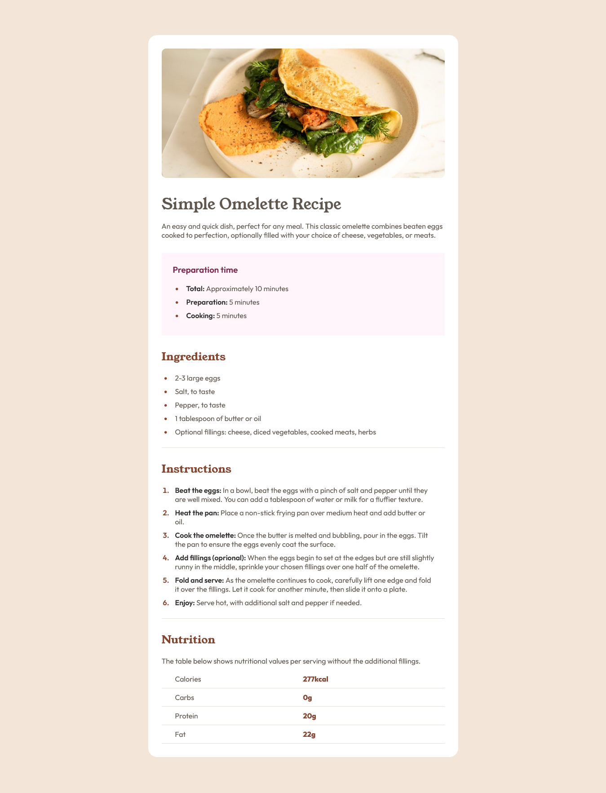

# Frontend Mentor - Recipe page solution

This is a solution to the [Recipe page challenge on Frontend Mentor](https://www.frontendmentor.io/challenges/recipe-page-KiTsR8QQKm). Frontend Mentor challenges help me improve my coding skills by building realistic projects.

## Table of contents

- [Overview](#overview)
  - [Screenshot](#screenshot)
  - [Links](#links)
- [My process](#my-process)
  - [Built with](#built-with)
  - [What I learned](#what-i-learned)
- [Author](#author)

## Overview

### Screenshot

### Links

- Live Site URL: [Recipe page Awan](https://recipe-page-fem-one.vercel.app/)

## My process

### Built with

- Semantic HTML5 markup
- Static Font
- CSS (flexbox, media query, @font-face)

### What I learned

In this project I learned how to use semantic html for list and table, adding style for them, and make it responsive.

## Author

- Frontend Mentor - [@soniawan](https://www.frontendmentor.io/profile/soniawan)
